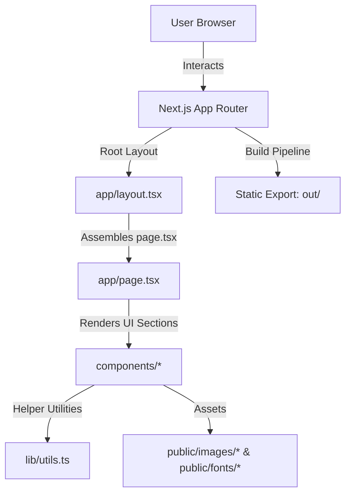

# BRAIN.md - Drip Hunter Codebase Specification

This document serves as the single source of truth and system specification for the **Drip Hunter** streetwear ecommerce catalog platform. It details the architecture, file structure, component states, styling decisions, and build pipelines.

---

## 1. Project Overview & Business Logic

**Drip Hunter** is a premium, high-fidelity streetwear catalog showcase website designed to reflect urban style aesthetics (grunge grids, retro cyberpunk assets, glassmorphism, bold block typography). 

### Purpose & Objectives:
- **Style Showcase**: Engage users through micro-animations, continuous logo marquees, interactive notice boards, and a CRT television mock feed simulator.
- **Static Delivery**: Engineered as a fully static Next.js compilation (`output: 'export'`) for optimized speed and cost-free hosting on static platforms (e.g. Netlify, GitHub Pages).

---

## 2. System Architecture & Tech Stack



### Core Technologies:
- **Framework**: Next.js 16.2.10 (using App Router and Turbopack compiler).
- **Styling**: Tailwind CSS v4 (configured via `@import` rules in `globals.css` with PostCSS).
- **Icons**: Lucide React (`lucide-react`).
- **UI Library**: Shadcn (initialized with v4 presets).

---

## 3. Directory Structure & File Relationships

```
drip-hunter/
├── app/
│   ├── globals.css         # Tailwind directives, custom fonts, animations
│   ├── layout.tsx          # TooltipProvider wrapper, core layout
│   └── page.tsx            # Main homepage assembler
├── components/
│   ├── Navbar.tsx          # Header search & subcategory navigation
│   ├── HeroSection.tsx     # Sliding promo banner & marquee ribbon
│   ├── NewArrivals.tsx     # Featured items & responsive product grid
│   ├── PromoBanners.tsx    # Deal cards & countdown timer
│   ├── BrandMarquee.tsx    # Infinite scrolling brand partners
│   ├── FeaturedLookbook.tsx# Multi-grid lookbook overlays
│   ├── TrendCategories.tsx # Hover zoom collection category panels
│   ├── RecentlyViewed.tsx  # Horizontal history card carousel
│   ├── MediaCollage.tsx    # Community collage & mock ads showcase
│   ├── TikTokReels.tsx     # Fake mobile reels and analytics
│   ├── NoticeBoard.tsx     # Bulletin corkboard & interactive sticky notes
│   ├── CustomerReviews.tsx # Review slider & verified client avatars
│   ├── RetroTechBanner.tsx # Interactive CRT TV simulator & cyber links
│   └── Footer.tsx          # Navigation directory & newsletter form
├── lib/
│   └── utils.ts            # clsx & tailwind-merge helper (cn classnames)
├── public/
│   ├── fonts/              # Custom woff2 fonts (Humane, Chaney, HK Guise)
│   └── images/             # Core generated backgrounds (hero, corkboard, TV)
├── next.config.ts          # Static export configuration & remote patterns
├── components.json         # Shadcn configuration
└── package.json            # Scripts & project dependencies
```

### Core Import/Dependency Matrix:
```
[app/page.tsx]
  ├── [components/Navbar]
  ├── [components/HeroSection]
  ├── [components/NewArrivals]
  │     └── [next/image] (Unsplash remote photos)
  ├── [components/PromoBanners]
  ├── [components/BrandMarquee]
  ├── [components/FeaturedLookbook]
  ├── [components/TrendCategories]
  ├── [components/RecentlyViewed]
  ├── [components/MediaCollage]
  ├── [components/TikTokReels]
  ├── [components/NoticeBoard]
  │     └── [next/image] (Local corkboard asset)
  ├── [components/CustomerReviews]
  ├── [components/RetroTechBanner]
  │     └── [next/image] (Local CRT TV asset)
  └── [components/Footer]
```

---

## 4. Detailed Component & State Flows

### `Navbar.tsx`
- **Announcement Ticker**: A simple text banner styled with a slow pulse animation.
- **Search Component**: A round search pill with a category selector dropdown.
- **Subcategory Row**: Horizontal row of category circles. Uses Next.js `Image` components loaded from Unsplash.
- **Filter Tabs Bar**: Manages a string state (`activeTab`). Updates colors dynamically.

### `HeroSection.tsx`
- **Slide State**: Manages `activeSlide` index state. The switcher switches titles, descriptions, tags, and syncs slide-indicators.
- **Ribbon Marquee**: Continuous left-scrolling text marquee using CSS animations.

### `PromoBanners.tsx`
- **Timer State**: Manages countdown time (`hours`, `minutes`, `seconds`) using a standard React `useEffect` interval loop firing every second.

### `NoticeBoard.tsx`
- **Interactive Modals**: Clicking any pinned sticky note stores the selected note object in state (`selectedNote`). When populated, it displays a fullscreen modal overlay mimicking a realistic pinned note detail.

### `RetroTechBanner.tsx`
- **CRT Simulator**: Clicking the TV screen toggles a boolean state (`staticScreen`). When enabled, the TV screen transitions from the glowing brand logo to an animated static gray noise overlay.
- **Youtube Icon Workaround**: Since Lucide v0.400+ deprecated social brand icons to reduce size, a custom inline vector SVG `<Youtube>` component is declared inside this file.

---

## 5. Styling Decisions & Configuration

### Custom Typography System
Typography is declared via `@font-face` bindings at the top of `app/globals.css`:
- **`Humane-Medium`**: (Mapped to `--font-humane`) Super tall, condensed modern streetwear headline font. Used in hero elements and lookbooks.
- **`CHANEY-Wide`**: (Mapped to `--font-heading`) Wide uppercase block font. Used for main section headers and branding.
- **`HK Guise`**: (Mapped to `--font-sans` and `--font-mono`) A clean, highly legible custom sans-serif typography set used for descriptions, products, and notices.

### Tailwind v4 Configuration (`next.config.ts`)
- **Static Export**: Enabled `output: 'export'` inside the configuration. Next.js static exports compile pages into fully static HTML files located under `/out`.
- **Image Unoptimization**: Static exports do not support default next/image SSR optimization. Hence, `images.unoptimized: true` is configured in `next.config.ts`.
- **Allowed Hosts**: Remote patterns are enabled for `images.unsplash.com` to fetch premium photography.

---

## 6. Operation & Maintenance

### Critical Workflows
1. **Development Run**: `npm run dev` launches local development server at `http://localhost:3000`.
2. **Build and Export**: `npm run build` runs compilation, executes TypeScript checks, and exports static assets to the `/out` directory.

### Risks and Technical Debt
- **Unsplash Availability**: Remote product imagery depends on the stability of Unsplash CDNs. If image paths break, cards will render broken images. (For production deployment, it is advised to save these assets locally in `/public/images/products`).
- **Hydration Warning Safe**: Interactive client-side states (like timers and static screens) are wrapped appropriately in `"use client"` blocks.
